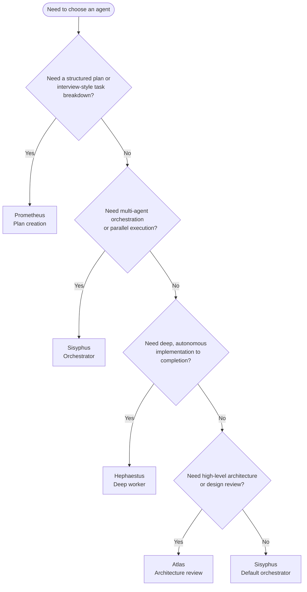

# PROJECT KNOWLEDGE BASE

**Generated:** 2026-01-31
**Commit:** 3c09eed
**Branch:** main

## OVERVIEW

Korean retirement pension fund portfolio recommendation system for 과학기술공제회 (SEMA). Multi-agent system for portfolio analysis with hallucination prevention. Fund data sourced from Zeroin, stored as JSON.

## AGENT SELECTION FLOWCHART



## STRUCTURE

```
investmunts_cbd/
├── AGENTS.md                   # This file (project knowledge base)
├── README.md                   # Investment management guide & rebalancing workflow
│
├── funds/                      # Core fund data
│   ├── fund_data.json          # Master data (2015 funds)
│   ├── fund_fees.json          # Fee data
│   ├── fund_classification.json # Category classification (6 types)
│   ├── deposit_rates.json      # Deposit rate data
│   └── README.md               # Fund index (sorted by return)
│
├── portfolios/                 # Auto-generated portfolio analysis reports
│   └── YYYY-MM-DD-{profile}-{id}/
│       ├── 00-macro-outlook.md       # 거시경제 전망
│       ├── 01-fund-analysis.md       # 펀드 분석 (or 01-leadership-analyst.md)
│       ├── 02-compliance-report.md   # 규제 준수 검증
│       ├── 03-output-verification.md # 출력 검증
│       └── 04-portfolio-summary.md   # 최종 요약
│
├── consultations/              # Investment consultation reports
│   └── YYYY-MM-DD-{ticker}-{topic}/
│
├── honeypot/                   # Plugin submodule (git submodule)
│   └── plugins/investments-portfolio/
│       ├── agents/             # 12 Multi-agent system
│       ├── skills/             # 11 Specialized skills
│       └── scripts/            # Data pipeline scripts
│
├── resource/                   # Source CSV files from SEMA
├── docs/                       # Reference documentation
└── .sisyphus/                  # Work session artifacts
    ├── plans/                  # Refactoring plans
    └── drafts/                 # Draft documents
```

## WHERE TO LOOK

| Task | Location | Notes |
|------|----------|-------|
| **Portfolio Analysis** | `honeypot/plugins/investments-portfolio/` | Multi-agent system |
| Fund master data | `funds/fund_data.json` | Single source of truth (2015 funds) |
| Fund categories | `funds/fund_classification.json` | 6 categories |
| Fee data | `funds/fund_fees.json` | Fund fee information |
| Deposit rates | `funds/deposit_rates.json` | Bank deposit rates |
| Portfolio reports | `portfolios/` | Auto-generated analysis |
| Consultation reports | `consultations/` | Investment consultations |
| Source CSV files | `resource/` | Monthly CSV from SEMA |
| Reference docs | `docs/` | Architecture & improvement plans |

## MULTI-AGENT SYSTEM

### Agent Architecture (macro-analysis + investments-portfolio)

| Agent | Plugin | Role | When Invoked |
|-------|--------|------|--------------|
| **portfolio-orchestrator** | investments-portfolio | Orchestrator - coordinates entire workflow | Entry point for all analysis |
| **fund-portfolio** | investments-portfolio | Fund recommendation with Bogle principles | Portfolio phase |
| **compliance-checker** | investments-portfolio | DC 70% risk limit verification | After fund selection |
| **output-critic** | investments-portfolio | Final output hallucination check | Before delivery |
| **material-organizer** | investments-portfolio | Organize collected research materials | On-demand |
| **index-fetcher** | macro-analysis | Fetch index data with 3-source cross-verification | Macro analysis phase |
| **rate-analyst** | macro-analysis | Fed/BOK rate & USD/KRW analysis | Macro analysis phase |
| **sector-analyst** | macro-analysis | 5-sector outlook analysis | Macro analysis phase |
| **risk-analyst** | macro-analysis | Risk analysis & Bull/Base/Bear scenarios | Macro analysis phase |
| **leadership-analyst** | macro-analysis | Political leadership & central bank analysis (7 countries) | Macro analysis phase |
| **macro-synthesizer** | macro-analysis | Synthesize macro analysis reports | After all analysts complete |
| **macro-critic** | macro-analysis | Independent verification of macro data | After synthesizer |

### Skill Architecture (honeypot/plugins/investments-portfolio/skills/)

| Skill | Purpose |
|-------|---------|
| **analyst-common** | Common web search patterns for analysts |
| **bogle-principles** | Vanguard/Bogle investment philosophy |
| **dc-pension-rules** | DC pension 70% risk limit rules + sector correlation matrix |
| **perspective-balance** | Bull/Bear balanced analysis (NEW) |
| **devil-advocate** | Contrarian review & assumption challenging (NEW) |
| **fund-selection-criteria** | Fund selection criteria & scoring |
| **fund-output-template** | Portfolio recommendation output format |
| **macro-output-template** | Macro analysis output format |
| **file-save-protocol** | File naming & save conventions |
| **web-search-verifier** | Web search result verification |
| **data-updater** | CSV to JSON data update procedures |

### Analysis Workflow

```
[1] portfolio-orchestrator (Entry)
         │
         ├──[Parallel Macro Analysis]──────────────────────┐
         │      │                                          │
         │      ├── index-fetcher (3-source verification)  │
         │      ├── rate-analyst (Fed/BOK/FX)              │
         │      ├── sector-analyst (5 sectors)             │
         │      └── risk-analyst (scenarios)               │
         │                                                 │
         ├──[Synthesis]────────────────────────────────────┤
         │      │                                          │
         │      ├── macro-synthesizer (combine reports)    │
         │      └── macro-critic (independent verify)      │
         │                                                 │
         ├──[Portfolio Phase]──────────────────────────────┤
         │      │                                          │
         │      ├── fund-portfolio (recommendations)       │
         │      └── compliance-checker (DC 70% limit)      │
         │                                                 │
         └──[Verification]─────────────────────────────────┘
               │
               └── output-critic (hallucination check)
```

### Invoking Portfolio Analysis

**Command**: `/investments-portfolio:portfolio-orchestrator`

```markdown
/investments-portfolio:portfolio-orchestrator 나를 위한 새로운 포트폴리오를 구성해줘.

| 항목 | 내용 |
|------|------|
| **생년** | 1992년 (만 33세) |
| **직업** | 정부출연연구원 (정부출연연구원) |
| **은퇴 예정** | 65세 (2057년, 약 31년 후) |
| **투자 성향** | **공격형** (30년+ 장기투자) |
| **위험 수용도** | 높음 (단기 -30% 손실 감내 가능) |
```

**필수 프로필 항목**:
| 항목 | 설명 |
|------|------|
| 생년 | 투자 기간 산정용 |
| 직업 | 소득 안정성 평가 |
| 은퇴 예정 | 투자 호라이즌 결정 |
| 투자 성향 | 안정형/중립형/공격형 |
| 위험 수용도 | 손실 감내 수준 |

The portfolio-orchestrator agent will coordinate the entire multi-agent workflow based on the provided investor profile.

## FUND DATA

### Categories (6 types, 2015 funds total)

| Category | Count | Description |
|----------|------:|-------------|
| 주식형 | 1,081 | Domestic equity |
| 해외주식형 | 717 | Global equity |
| 채권형 | 100 | Bonds |
| 채권혼합형 | 78 | Bond-mixed |
| 혼합형 | 38 | Balanced |
| MMF | 1 | Money market |

### Data Files

| File | Description | Record Count |
|------|-------------|-------------:|
| `fund_data.json` | Master fund data | 2,015 |
| `fund_fees.json` | Fee information | 2,015 |
| `fund_classification.json` | Category mapping | 2,015 |
| `deposit_rates.json` | Deposit rates | varies |

### Schema (fund_data.json)

```json
{
  "_meta": {
    "version": "2026-01-01",
    "sourceFile": "26년01월_상품제안서_퇴직연금(DCIRP).csv",
    "updatedAt": "2026-01-21T22:07:46+09:00",
    "recordCount": 2015
  },
  "funds": [
    {
      "fundCode": "K55232DU8475",
      "name": "펀드명",
      "company": "운용사",
      "riskLevel": 2,
      "riskName": "높은",
      "return10y": "", "return7y": "", "return5y": "",
      "return3y": "70.34", "return1y": "178.03", "return6m": "30.03",
      "netAssets": "508400000000",
      "inceptionDate": "20220627",
      "isAffiliate": false,
      "fundType": "ETF"
    }
  ]
}
```

## DATA UPDATE WORKFLOW

### Monthly Fund Data Update

**When**: Monthly (after receiving new CSV from 과학기술공제회)

**Steps**:
1. Place new CSV file in `resource/` directory
2. Run update script:
   ```bash
   python honeypot/plugins/investments-portfolio/scripts/update_fund_data.py \
     --file resource/YYYY년MM월_상품제안서_퇴직연금(DCIRP).csv
   ```
3. Verify outputs:
   - `funds/fund_data.json` - Updated fund data
   - `funds/fund_fees.json` - Updated fee data
   - `funds/fund_classification.json` - Auto-regenerated

**Dry-run mode** (preview without changes):
```bash
python honeypot/plugins/investments-portfolio/scripts/update_fund_data.py \
  --dry-run --file resource/YYYY년MM월_상품제안서_퇴직연금(DCIRP).csv
```

### Scripts Location

```
honeypot/plugins/investments-portfolio/scripts/
├── update_fund_data.py     # CSV → JSON pipeline
├── classify_funds.py       # Generate fund_classification.json
└── README.md               # Script documentation
```

## CONVENTIONS

### Fund Categorization (6 types)

Classification by keyword matching in fund name:
- **Region first**: 해외/글로벌/미국/차이나 → 해외주식형
- **Asset class**: 주식 (주식형), 채권 (채권형), 혼합 (혼합형/채권혼합형)
- **Special**: MMF → MMF

### Commit Protocol

파일 변경 후 **반드시** 아래 절차를 따를 것:

1. **변경 요약 작성**: 무엇이 변경되었는지 명확히 정리
2. **커밋 메시지 제안**: 상세한 커밋 메시지 작성
3. **사용자 확인 요청**: 커밋 여부를 사용자에게 문의

**커밋 메시지 형식**:
```
<type>: <subject>

<body>
- 변경 사항 1
- 변경 사항 2

<footer>
```

**Type 종류**:
| Type | 설명 |
|------|------|
| `feat` | 새로운 기능/계획 추가 |
| `fix` | 오류 수정 |
| `docs` | 문서 수정 |
| `refactor` | 구조 변경 (기능 변화 없음) |
| `chore` | 기타 유지보수 |

### Language Policy

- 모든 설명과 지침은 항상 한국어로 작성할 것

## ANTI-PATTERNS

| Forbidden | Reason |
|-----------|--------|
| Edit `fund_data.json` manually | Use update scripts |
| Skip macro-critic verification | Hallucination risk |
| Ignore DC 70% limit | Regulatory violation |
| Single-source data claims | Must cross-verify with 3 sources |
| Skip output-critic | Final hallucination check required |

## PENSION OPERATION STRATEGY

### DC형 퇴직연금 (SEMA)

| 항목 | 내용 |
|------|------|
| **계좌** | 과학기술인공제회 (SEMA) |
| **위험자산 한도** | 70% |
| **상품 유형** | 액티브 펀드 |
| **운용 비용** | 0.5~1.5% (총보수) |
| **운용 전략** | 섹터/테마 집중, 알파 추구 |

### Risk Asset Classification

| 위험자산 (70% 한도) | 안전자산 (30% 이상) |
|---------------------|---------------------|
| 주식형 | 채권형 |
| 해외주식형 | MMF |
| 혼합형 | 예금 |
| 채권혼합형 | - |

### Sector Correlation (40% Overlap Limit)

High-correlation sectors (treat as single exposure):
- **Tech/AI Group**: 반도체, AI, 로봇, 데이터센터
- **Energy Group**: 원자력, 신재생에너지, 전력인프라

## HALLUCINATION PREVENTION

### Multi-Layer Defense

```
Layer 1: index-fetcher        → 3-source cross-verification
Layer 2: macro-critic         → Independent index verification
Layer 3: perspective-balance  → Bull/Bear balanced analysis
Layer 4: devil-advocate       → Contrarian assumption challenge
Layer 5: output-critic        → Final verification against fund_data.json
```

### Verification Requirements

| Claim Type | Minimum Sources |
|------------|-----------------|
| Index data (S&P500, KOSPI) | 3 sources |
| Interest rate forecasts | 2 sources |
| Sector outlooks | 2 sources |
| Fund performance | fund_data.json (authoritative) |

## NOTES

- **Data source**: 과학기술공제회 퇴직연금 + 펀드평가사 제로인
- **Base date**: 2026.01.21 (from fund_data.json _meta)
- **Submodule**: `honeypot/` is a git submodule - update with `git submodule update --remote`
- **Plugin registration**: Via Claude Code `/plugin marketplace add`
